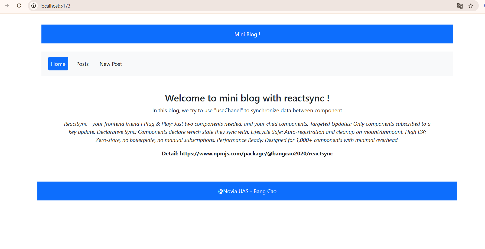

I did use 3 hours to build this app with Vite + React + Boostrap + ReactSync

Project structure:

- src:
   - components:
        - PostItem.tsx
		- MenuBar.tsx
		- Footer.tsx
		- Header.tsx
   - pages:
        - Home.tsx
		- Posts.tsx
		- PostDetail.tsx
		- PostEditor.tsx
		
   - layouts:
        - MainLayout.tsx
   - App.tsx
   - Main.tsx
   - route.tsx
   - index.css
   - mockData.tsx
How to run:
- npm install
- npm run dev

